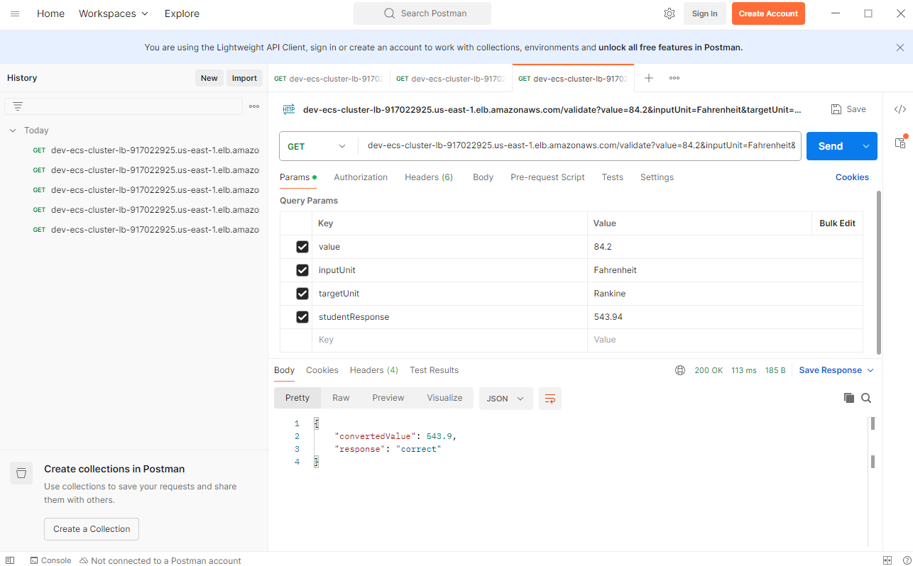

# conversion-app

## API Sample:
- **<ECS_LB_DNS>:/validate?value=84.2&inputUnit=Fahrenheit&targetUnit=Rankine&studentResponse=543.94**

## Sample Respone:
{
    "convertedValue": 543.9,
    "response"      : "correct:
}

## Postman API Sample

## Application FrontEnd

**GitHub Actions Varibles in conversion-app Repo**
- **AWS_REGION** : "us-east-1"

**GitHub Actions Secrets in conversion-app Repo**
- **AWS_ACCESS_KEY_ID** : hidden
- **AWS_SECRET_ACCESS_KEY** : hidden
- **DOCKER_PASSWORD** : hidden
- **DOCKER_USERNAME** : hidden
- **GIT_INFRA_REPO_TOKEN** : hidden

This Repository contains the Application Code and the workflow for **CI** and **CD** of the application.

All the workflows are designed using GitHub Actions and runs on **ubuntu-latest** machine provided by GitHub.

To run any workflow team / users just need access to the repo and run the workflow without checking out the Git Repo itself.

## Application Complete CI/CD Workflow

**Workflow**: **Application_CI_CD_Workflow**

The complete workflow is triggered only when code from branch is merged to **main** branch

The **App_Version** and **Deployment Environment** is comtrolled by **conversion-app-deploy-config.json** ensure that these are updated accrodingly before creating a Pull Request.

### Available Deployment Environments (case sensitive)
- **dev**
- **stg**
- **prod**

### Default Values
- **App_Version** : **latest**
- **Environment** : **dev**

## Application CI Workflow

**Workflow**: **Application_CI_Workflow**

Application CI can be triggered individually so that the application docker image can the pused to DockerHub.

Please refer to the worflow diagram

**Note** : Please use the right **App_Version** while running the workflow.
**Default Value** 
- **App_Version** : **latest**

## Application CD Workflow

**Workflow**: **Application_CD_Workflow**

Application CD can be triggered individually so that the application can be deployed to AWS Environment to ECS Fargate Cluster. 

Any valid docker image can be used to deploy. (Please ensure that the relevant configuration information is updated accordingly in the Infra Repo which uses Terraform)

**Infra Repo** for App Config Updates: **https://github.com/hbekal005/conversion-app-infra.git**

**Default Value**
- **App_Version** : **latest**
- **Environment** : **dev**

**GitHub Actions Varibles in Infra Repo**
- **AWS_REGION** : "us-east-1"

**GitHub Actions Secrets in Infra Repo**
- **AWS_ACCESS_KEY_ID** : hidden
- **AWS_SECRET_ACCESS_KEY** : hidden

Please refer to the worflow diagram

**Note** : Please use the right **App_Version** and **Environment** while running the workflow.

## Suggested Improvements

1.	Register a domain and link to the ECS AWS LB via the A-record and Route53 service so that user can access frontend via static domain name.
2.	Implement better security in GitHub by having the right ruleset implemented
3.	Have an automated way / workflow for application versioning.
4.	Branch protection rules and Code Security in GitHub Repo for both (conversion-app & conversion-app-infra)
5.	Provide better guardrails on Terraform / App Deprovision Workflow.